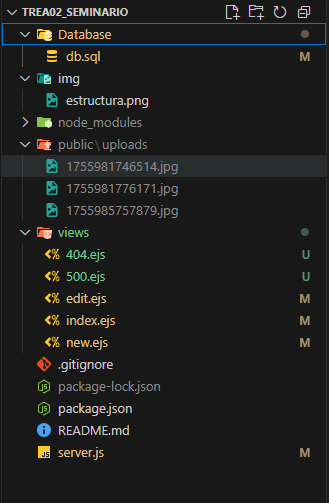

# 📦 CRUD de Cotizaciones con Express.js + MySQL  

Este proyecto es un **CRUD básico** desarrollado con **Node.js + Express.js** como framework principal y **MySQL** como base de datos.  
Actualmente solo contiene la **estructura mínima funcional**, sin diseño ni estilos visuales avanzados.  

---

## 🚀 Tecnologías usadas  
- **Node.js** – entorno de ejecución  
- **Express.js** – framework web  
- **MySQL2** – conexión a base de datos  
- **Multer** – manejo de subida de imágenes  
- **EJS** – motor de vistas (HTML dinámico)  

---

## 📂 Estructura del proyecto  

---

## 🔧 Características principales  
✔️ CRUD completo (Crear, Leer, Actualizar y Eliminar cotizaciones).  
✔️ Manejo de imágenes con **Multer**.  
✔️ Las imágenes ya **no se acumulan en la carpeta `uploads/`**:  
   - Al **actualizar** una cotización con nueva imagen, la anterior se elimina automáticamente.  
   - Al **eliminar** una cotización, también se borra su imagen física.  
✔️ Uso de **EJS** para vistas dinámicas.  
✔️ Base de datos MySQL conectada con **mysql2**.  

---

## 📌 Mejoras pendientes  
- Agregar diseño con CSS/Bootstrap/Tailwind.  
- Manejo de errores más amigable en vistas.  
- Agregar navegación más clara (botones de volver a `index`, etc).  
- Crear un archivo de configuración para separar credenciales de la BD.  
